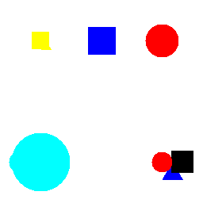

# Identicon4s

Simple scala library for generating identicons - visual hashes for arbitrary string.

## How it works

- Take a string as an input
- Generate hash
- Use the hash as a random seed
- Randomly choose the layout, by default combine from 1 to 3 random basic layout
- Fill the layout with randomly selected shapes
- Generate 2D image

## Usage

### Basic

The most basic use case is covered by the `defaultInstance`.

```scala
import net.michalp.identicon4s.Identicon
val identicon = Identicon.defaultInstance[Id]()

val image = identicon.generate("test")
val f = new File(s"test.png");
ImageIO.write(image, "png", f)
```

Resulting image


### Advanced

Identicon is configurable. You can tune the amount of layout selection iterations and turn on the coloring.

```scala
val config = Identicon.Config(
  minLayoutIterations = 5,
  maxLayoutIterations = 10,
  renderMonochromatic = false
)
import net.michalp.identicon4s.Identicon
val identicon = Identicon.defaultInstance[Id](config)

val image = identicon.generate("test")
val f = new File(s"test.png");
ImageIO.write(image, "png", f)
```

Resulting image



There's also `def instance[F[_]: Hashing: Functor](config: Config)` method that allows you to instantiate `Identicon` with custom your own implementation of `Hashing`.
